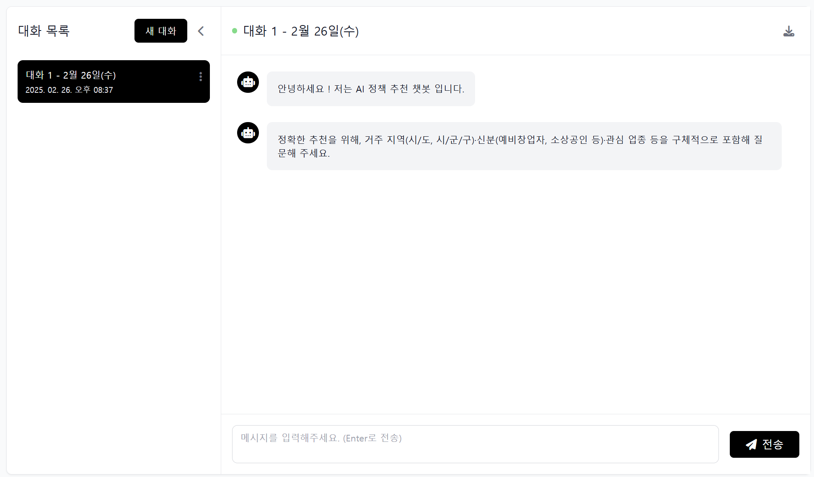

# 팀 ISEEU: MS AI SCHOOL 5기 3차 5팀 프로젝트


## 프로젝트 개요
### 팀 정보
- **프로젝트명:** CV 기반 유동인구 데이터베이스화 및 LLM 활용 보고서 및 대시보드 개발
- **팀 구성:** 나정환, 김현준, 남궁찬, 박성빈, 윤여경, 정성준, 조나경, 홍승우
- **프로젝트 기간:** 2025.01.16~ 2025.02.27

### 기획의도
1. 데이터 기반 의사결정을 위한 소상공인 개인별 데이터베이스를 구축할 수 있는 CV 모델 개발.
2. 유저 친화적 인터페이스를 통해 비전문가도 쉽게 데이터를 확인 가능한 통계분석 대시보드 서비스 개발.
3. 데이터 분석 결과를 활용하여 사용자 상황(context)에 맞는 상권 최적화 및 매출 개선 방안과 같은 인사이트 제공해 줄 수 있는 보고서 작성 자동화.
4. 전처리된 정책문서를 바탕으로 정보를 제공하는 챗봇 개발

## 기술 스택
- 프론트엔드: 
    

- 백엔드: 
  
- 데이터베이스: 
   
- CV 모델: 
   
- LLM 모델: 
 

## 서비스
- 내 모니터링  
  

- CCTV 확인  
  

- Dashboard  
  

- AI 인사이트  
  

- 챗봇  
  

## 서비스 아키텍처
- **Web page**  
  

- **Server**  
  

- **Database**  
  

- **CV-model**  
  

- **Report-generator**  
  

- **Chatbot**  
  

## 프로젝트 구조도
```
FOOTTRAFFICREPORT [SSH: 20.39.188.60]
│── .github/
│── backend/
│   │── alembic/
│   │   │── __pycache__/
│   │   │── versions/
│   │   │   │── __pycache__/
│   │   │   │── (마이그레이션 스크립트 파일들)
│   │   │── env.py
│   │   │── README
│   │   │── script.py.mako
│   │── app/
│   │   │── __pycache__/
│   │   │── (FastAPI 관련 Python 파일들)
│   │── .env
│   │── alembic.ini
│   │── celerybeat-schedule
│   │── Dockerfile
│   │── requirements.txt
│── chatbot/
│   │── src/
│   │   │── main.py
│   │── .env
│   │── Dockerfile
│   │── requirements.txt
│── frontend/
│   │── .github/
│   │── client/
│   │   │── .vite/
│   │   │── dist/
│   │   │── node_modules/
│   │   │── public/
│   │   │── src/
│   │   │   │── components/
│   │   │   │   │── ProtectedRoute.jsx
│   │   │   │   │── ResponsiveNav.jsx
│   │   │   │── context/
│   │   │   │   │── AppContext.jsx
│   │   │   │── pages/
│   │   │   │   │── AInsight.jsx
│   │   │   │   │── CCTVMonitoring.jsx
│   │   │   │   │── Chatbot.jsx
│   │   │   │   │── Chatbot_guide.jsx
│   │   │   │   │── Dashboard.jsx
│   │   │   │   │── DeviceConnect.jsx
│   │   │   │   │── Guide.jsx
│   │   │   │   │── LiveStreamPlayer.jsx
│   │   │   │   │── Login.jsx
│   │   │   │   │── Monitor.jsx
│   │   │   │   │── PrivacyOverlay.jsx
│   │   │   │   │── Signup.jsx
│   │   │   │── utils/
│   │   │   │   │── api.js
│   │   │   │   │── apiWrapper.js
│   │   │   │   │── auth.js
│   │   │   │   │── srswebrtc.js
│   │   │   │── webrtc/
│   │   │   │   │── mediasoupclient.js
│   │   │   │── App.css
│   │   │   │── App.jsx
│   │   │   │── index.css
│   │   │   │── main.jsx
│   │   │── eslint.config.js
│   │   │── index.html
│   │   │── package-lock.json
│   │   │── package.json
│   │   │── postcss.config.cjs
│   │   │── tailwind.config.js
│   │   │── vite.config.js
│   │── server/
│   │   │── node_modules/
│   │   │── src/
│   │   │   │── hls/
│   │   │   │   │── ffmpegRunner.js
│   │   │   │   │── index.js
│   │   │   │   │── passportConfig.js
│   │   │   │   │── signaling.js
│   │   │── .env
│   │   │── Dockerfile
│   │   │── package-lock.json
│   │   │── package.json
│   │   │── .dockerignore
│   │   │── .gitmessage.txt
│   │   │── LICENSE
│── media-server/
│   │── .dockerignore
│   │── Dockerfile
│   │── index.js
│   │── package-lock.json
│   │── package.json
│── nginx/
│   │── mycctv.conf
│── people-detection/
│   │── data/
│   │── model/
│   │   │── yolo11n-pose.pt
│   │── src/
│   │   │── utils/
│   │   │   │── Augment.ipynb
│   │   │   │── Azure_Update.ipynb
│   │   │   │── Evaluate.py
│   │   │── main.py
│   │── .env
│   │── Dockerfile
│   │── requirements.txt
│── report-generation/
│   │── __pycache__/
│   │── data_graph/
│   │── fonts/
│   │   │── MalgunGothic.ttf
│   │── src/
│   │   │── __init__.py
│   │   │── data_processing.py
│   │   │── gpt_response.py
│   │   │── main.py
│   │   │── visualization.py
│   │── .env
│   │── Dockerfile
│   │── requirements.txt
│── srs/
│   │── srs.conf
│── .env
│── .gitignore
│── .gitmessage.txt
│── docker-compose.yml
│── LICENSE
│── package-lock.json
```


